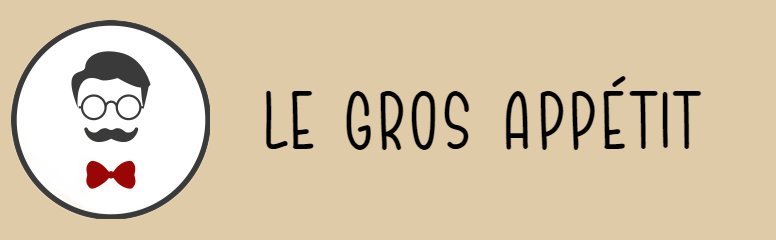

<h2>Overview</h2>

This project is about the creation of a fictitious Italian restaurant.
    The website simulates the site of an existing restaurant, where customers can view the menu items and create an online order.
    Employees of the restaurant can log in and view data related to their job; administrators can log in to view all existing orders and edit the menu items.  
    All rights belong to their respective owners. We do not plan to make this website a real business or make a profit from it.

<h2>Development Environment</h2>

Tools used to complete this project

<ul style="list-style-type: square;">
    <li>Visual Studio Code</li>
    <li>GitHub</li>
    <li>Google Maps API</li>
</ul>

<h2>Team Members:</h2>
<ul style="list-style-type: none;">
    <li>Rodrigo Rodriguez</li>
    <li>Chika Wonodi</li>
    <li>Sadiq Abubakar</li>
    <li>Michael Muir</li>
    <li>Dillon Godwin</li>
    <li>Marvis Igbineweka</li>
</ul>